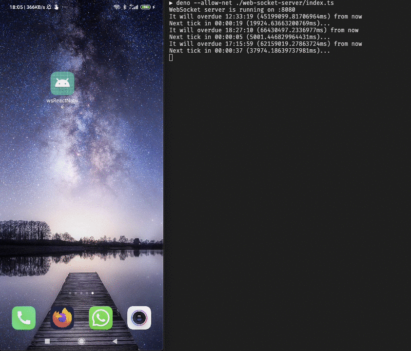

# web-socket-react-native
POC project using WebSocket server based on deno and the client based on React Native

## Running WebSocket on [Deno](https://deno.land)

First of all, follow the instal instructions at [Deno Land](https://deno.lan).

After you have installed it, you need to start the `WebSocket` and you can do that by running the following:

```bash
# If everthing went sucessfuly, you must see the message:
# "WebSocket server is running on :8008"
# it means the server is running on "ws://localhost:8080"
deno --allow-net ./web-socket-server/index.ts
```

## Running WebSocket client with [React Native](https://facebook.github.io/react-native/)

### Prerequirements

In order to run this, you must have the React Native installed and configured and `yarn` (or `npm` installed).

### Installing

Before installing the app, you need to have a device or emulator connected to your machine and run:

```bash
# To install all the dependencies
yarn # Or "npm install"
# To install the app on the device or emulator
yarn android # or "npm run android" or even "yarn ios" ("npm ios") for iOS
# Now wee need to redirect all calls from device "localhost:8080" to our machine "localhost:8080"
adb reverse tcp:8080 tcp:8080
```

If the `WebSocket` client didn't connect, try to reload your app by shaking your phone and pressing "Reload" or:

```bash
# Only valid for Android devices/emulators
adb shell input text "RR"
```

It will look like this:



